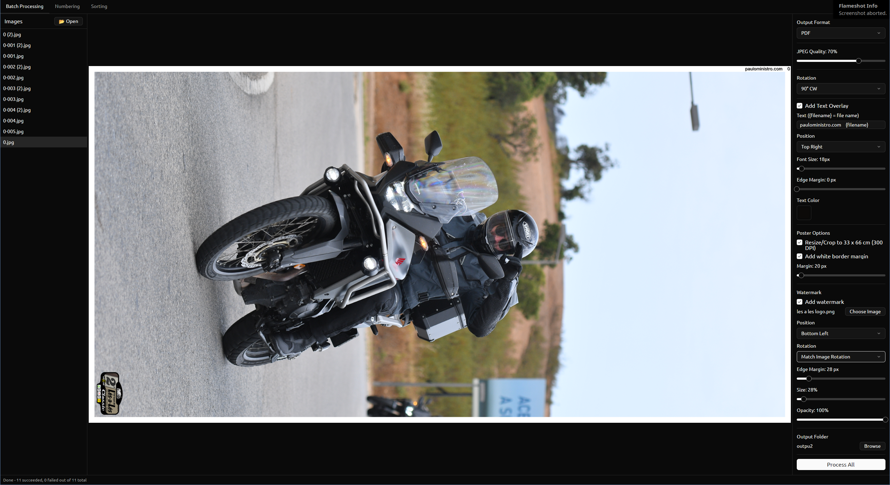

# Numera

An app for batch processing and numbering photos.  
Based on some features of FastStone Image Viewer.  
Created using the following [xtask-template](https://github.com/lucascompython/xtask-template).

## Features

- Able to convert images in batch to pdf/jpg
- Able to add text to the images (e.g. automatically add file name in the corner, useful for printing and selling posters)
- Able to rotate the images
- Poster options for 33x66cm centered crop/resize and optional white border margin
- Optional PNG/JPEG image watermark with position, rotation, opacity, and size controls
- Numbering mode for fast per-image number tagging
- OCR-based number suggestions
- Sorting mode to quickly sort photos into subfolders based on their name

## Batch processing preview

## Numbering mode preview

## Sorintg mode preview

## OCR setup (optional, Numbering mode)

The app can suggest motorcycle numbers using local ONNX OCR.

1. Put OCR assets in `models/ppocrv5/` (or set `BIP_OCR_MODEL_DIR`).
2. Ensure this folder contains:
   - `det.onnx`
   - `rec.onnx`
   - `PP-LCNet_x0_25_textline_ori.onnx`
   - `PP-LCNet_x1_0_doc_ori.onnx`
   - `ppocrv5_dict.txt`

If these files are missing, the app still runs, but OCR suggestions stay disabled.

### OCR acceleration device (optional)

OCR can use GPU/accelerator execution providers when compiled with the matching Cargo feature.

Examples:

- NVIDIA CUDA:
  - Build: `cargo run --release --features ocr-cuda`
  - Run: `BIP_OCR_DEVICE=cuda:0 ./target/release/numera`
- TensorRT:
  - Build: `cargo run --release --features ocr-tensorrt`
  - Run: `BIP_OCR_DEVICE=tensorrt:0 ./target/release/numera`
- DirectML (Windows): feature `ocr-directml`, `BIP_OCR_DEVICE=directml:0`
- CoreML (macOS): feature `ocr-coreml`, `BIP_OCR_DEVICE=coreml`
- OpenVINO: feature `ocr-openvino`, `BIP_OCR_DEVICE=openvino:GPU`
- WebGPU: feature `ocr-webgpu`, `BIP_OCR_DEVICE=webgpu`

Defaults:

- `BIP_OCR_DEVICE=cpu` (default)
- `BIP_OCR_THREADS` controls OCR intra-op threads. If unset, the app auto-detects CPU parallelism but caps the default at 8 threads so OCR does not make preview/navigation sluggish. Set this variable explicitly to override that default, for example `BIP_OCR_THREADS=16`.

Threading notes:

- `intra_threads` means threads used inside one ONNX Runtime operation/model node.
- `inter_threads` means threads used to run independent ONNX Runtime graph operations in parallel.
- The app uses `inter_threads=1` because OCR is mostly a small sequential pipeline and higher inter-op parallelism can oversubscribe the CPU without improving latency.
- ONNX Runtime graph optimizations, memory-pattern optimization, parallel execution mode, and CPU fallback are enabled for both CPU and accelerator configurations. GPU/accelerator providers run supported model operators on the device; CPU threads are still used for preprocessing, scheduling, unsupported fallback operators, and image loading.

If an accelerator provider is unavailable at runtime, OCR automatically falls back to CPU.

### Preview sizing

Numbering and batch previews are decoded to a bounded maximum side length for responsiveness.

Defaults:

- `BIP_PREVIEW_MAX_SIDE=2400` effective default.
- Accepted range is clamped to `512..8192`.

Increase it for sharper previews/zooming, for example:

- `BIP_PREVIEW_MAX_SIDE=3200 ./target/release/numera`

Decrease it if folder navigation is still too slow on your machine, for example:

- `BIP_PREVIEW_MAX_SIDE=1600 ./target/release/numera`

### Sticker template assist (Numbering mode)

You can load an event sticker template from the Numbering toolbar (`Sticker Template` button).
When loaded, OCR first tries to locate that sticker in each photo and prioritizes the number area
of that sticker before falling back to full-image OCR. This helps reduce confusion with old-event
stickers that appear in the same frame.
